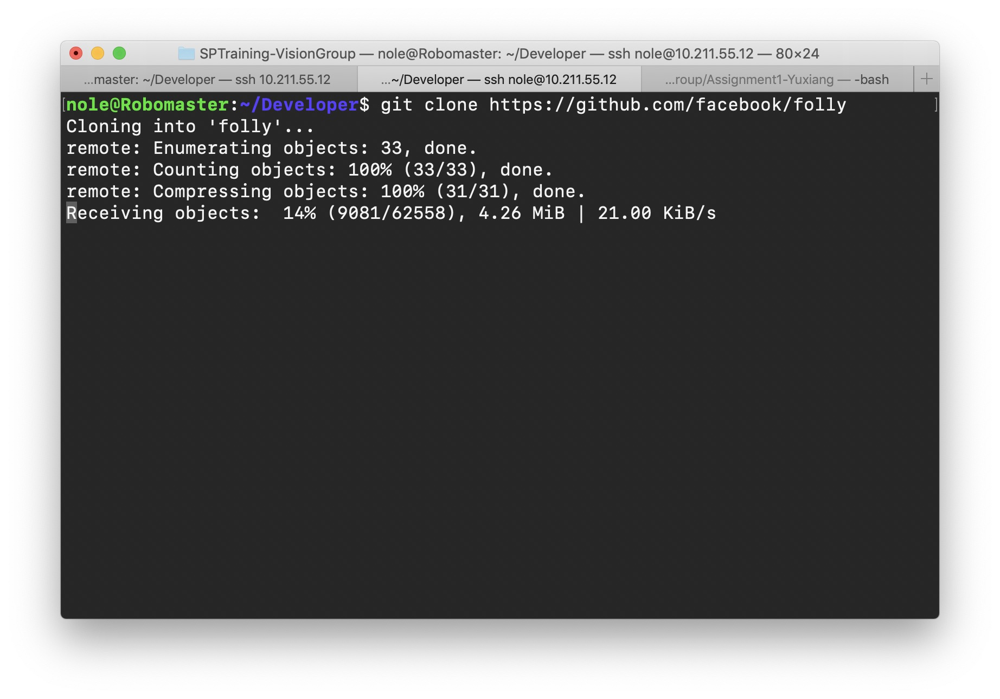
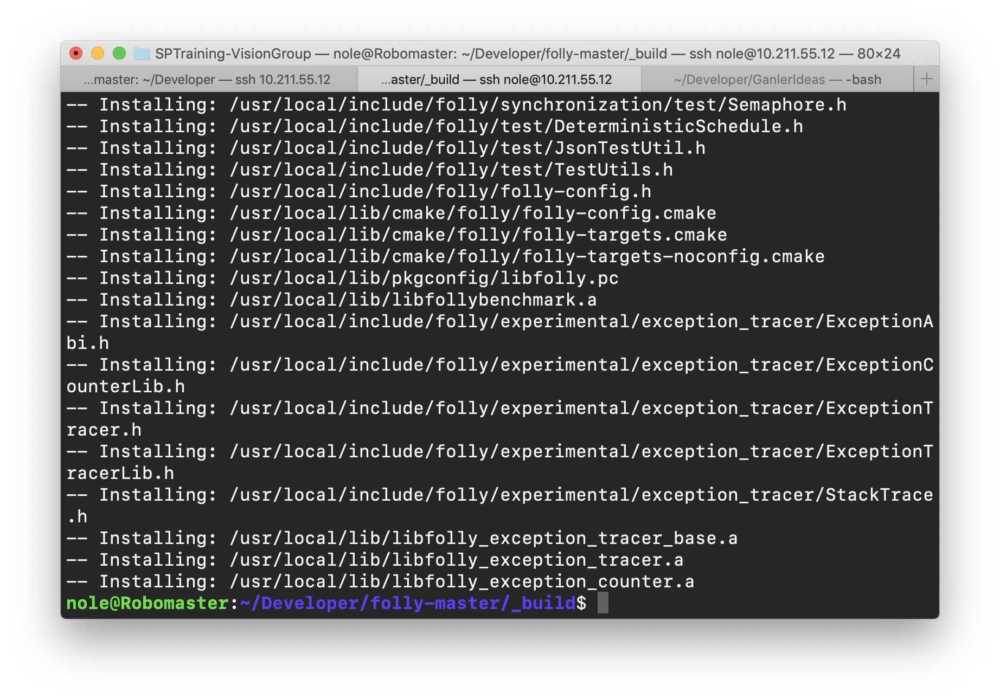

# Compiling Facebook Folly

## Result





## Script

```bash
git clone https://github.com/facebook/folly
cd folly

# Requirements, quote from ...facebook/folly
sudo apt-get install \
    g++ \
    cmake \
    libboost-all-dev \
    libevent-dev \
    libdouble-conversion-dev \
    libgoogle-glog-dev \
    libgflags-dev \
    libiberty-dev \
    liblz4-dev \
    liblzma-dev \
    libsnappy-dev \
    make \
    zlib1g-dev \
    binutils-dev \
    libjemalloc-dev \
    libssl-dev \
    pkg-config
    
mkdir _build && cd _build
cmake ..
make -j $(nproc) && sudo make install
```

