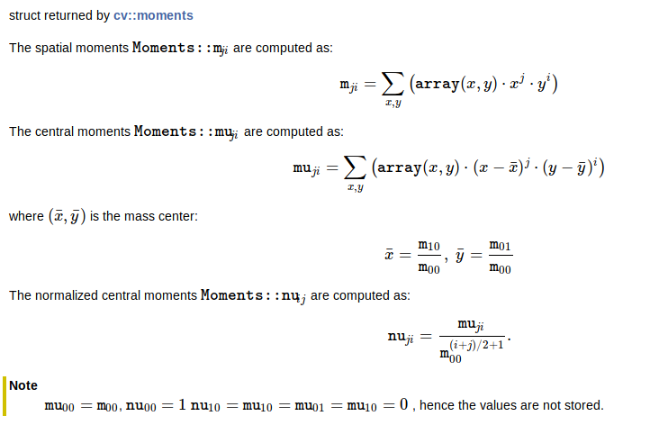

# Notes

## definition

- blob: a group of connected pixels in an image that share some common property

- cenroid: the weighted average of all the pixels constituting the shape

- image moments: a particular weighted average of image pixel intensities

  According to the opencv documentation:

  

  Obviously, the cenroid should be calculated by:

  Cx=m10/m00	Cy=m01/m00
##Steps

1. Convert the image to grayscale.
2. Perform binarization on the image.
3. Find the center of the image after calculating the moments.

## Function usage

### moments()

Moments cv::moments( InputArray    array, bool    binaryImage=false )

#### parameters

| array       | Raster image (single-channel, 8-bit or floating-point 2D array) or an array ( 1×N or N×1 ) of 2D points (Point or Point2f ). |
| :---------- | ------------------------------------------------------------ |
| binaryImage | If it is true, all non-zero image pixels are treated as 1's. The parameter is used for images only. |

#### Returns

moments

### circle()

void cv::circle( InputOutputArray    img, Point    center, int    radius, const Scalar&    color, int    thickness=1, int    lineType=LINE_8, int    shift=0 )

#### Parameters

| img       | Image where the circle is drawn.                             |
| --------- | ------------------------------------------------------------ |
| center    | Center of the circle.                                        |
| radius    | Radius of the circle.                                        |
| color     | Circle color.                                                |
| thickness | Thickness of the circle outline, if positive. Negative values, like [FILLED](https://docs.opencv.org/3.4/d0/de1/group__core.html#ggaf076ef45de481ac96e0ab3dc2c29a777a89c5f6beef080e6df347167f85e07b9e), mean that a filled circle is to be drawn. |
| lineType  | Type of the circle boundary.                                 |
| shift     | Number of fractional bits in the coordinates of the center and in the radius value. |

### findContours()

void cv::findContours( Input OutputArray    image, OutputArrayOfArrays    contours, OutputArray    hierarchy, int    mode, int    method, Point    offset=Point() )

#### Parameters

Parameters

| image     | Source, an 8-bit single-channel image. Non-zero pixels are treated as 1's. Zero pixels remain 0's, so the image is treated as binary . You can use [compare](https://docs.opencv.org/3.4/d2/de8/group__core__array.html#ga303cfb72acf8cbb36d884650c09a3a97), [inRange](https://docs.opencv.org/3.4/d2/de8/group__core__array.html#ga48af0ab51e36436c5d04340e036ce981), [threshold](https://docs.opencv.org/3.4/d7/d1b/group__imgproc__misc.html#gae8a4a146d1ca78c626a53577199e9c57) , [adaptiveThreshold](https://docs.opencv.org/3.4/d7/d1b/group__imgproc__misc.html#ga72b913f352e4a1b1b397736707afcde3), [Canny](https://docs.opencv.org/3.4/dd/d1a/group__imgproc__feature.html#ga04723e007ed888ddf11d9ba04e2232de), and others to create a binary image out of a grayscale or color one. If mode equals to [RETR_CCOMP](https://docs.opencv.org/3.4/d3/dc0/group__imgproc__shape.html#gga819779b9857cc2f8601e6526a3a5bc71a7d1d4b509fb2a9a8dc2f960357748752) or [RETR_FLOODFILL](https://docs.opencv.org/3.4/d3/dc0/group__imgproc__shape.html#gga819779b9857cc2f8601e6526a3a5bc71acc80715d6a2a51855cb3a9a8093a9352), the input can also be a 32-bit integer image of labels (CV_32SC1). |
| --------- | ------------------------------------------------------------ |
| contours  | Detected contours. Each contour is stored as a vector of points (e.g. std::vector<std::vector<cv::Point> >). |
| hierarchy | Optional output vector (e.g. std::vector<cv::Vec4i>), containing information about the image topology. It has as many elements as the number of contours. For each i-th contour contours[i], the elements hierarchy[i][0] , hierarchy[i][1] , hierarchy[i][2] , and hierarchy[i][3] are set to 0-based indices in contours of the next and previous contours at the same hierarchical level, the first child contour and the parent contour, respectively. If for the contour i there are no next, previous, parent, or nested contours, the corresponding elements of hierarchy[i] will be negative. |
| mode      | Contour retrieval mode, see [RetrievalModes](https://docs.opencv.org/3.4/d3/dc0/group__imgproc__shape.html#ga819779b9857cc2f8601e6526a3a5bc71) |
| method    | Contour approximation method, see [ContourApproximationModes](https://docs.opencv.org/3.4/d3/dc0/group__imgproc__shape.html#ga4303f45752694956374734a03c54d5ff) |
| offset    | Optional offset by which every contour point is shifted. This is useful if the contours are extracted from the image ROI and then they should be analyzed in the whole image context. |

### Canny()

void cv::Canny( InputArray    image, OutputArray    edges, double     threshold1, double    threshold2, int    apertureSize=3, bool    L2gradient=false)

#### Parameters

| image        | 8-bit input image.                                           |
| ------------ | ------------------------------------------------------------ |
| edges        | output edge map; single channels 8-bit image, which has the same size as image . |
| threshold1   | first threshold for the hysteresis procedure.                |
| threshold2   | second threshold for the hysteresis procedure.               |
| apertureSize | aperture size for the Sobel operator.                        |
| L2gradient   | a flag, indicating whether a more accurate L2 norm =(dI/dx)2+(dI/dy)2−−−−−−−−−−−−−−−−√ should be used to calculate the image gradient magnitude ( L2gradient=true ), or whether the default L1 norm =\|dI/dx\|+\|dI/dy\| is enough ( L2gradient=false ). |